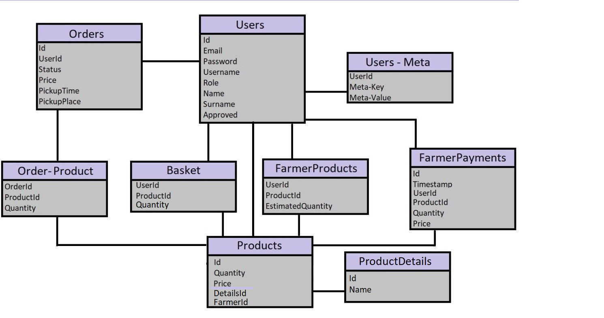

# DATABASE TABLES



## Users
|NAME|TYPE|DESCRIPTION|
|---|---|---|
|id|INTEGER||
|email|TEXT||
|password|TEXT||
|username|TEXT||
|role|TEXT|<ul><li>0 - client</li><li>1 - shop employee</li></ul>|
|name|TEXT||
|surname|TEXT||
|approved|INTEGER| Indicate if the user it is approved or not by default 0|

## users_meta
|NAME|TYPE|DESCRIPTION|
|---|---|---|
|id|INTEGER||
|user_id|INTEGER||
|meta_key|TEXT|name of the meta Example: wallet|
|meta_value|TEXT|value of the meta, Example wallet how much money in it|

## basket
|NAME|TYPE|DESCRIPTION|
|---|---|---|
|id|INTEGER||
|user_id|INTEGER|id of the basket's user|
|product_id|INTEGER||

## farmer_payments
|NAME|TYPE|DESCRIPTION|
|---|---|---|
|id|INTEGER||
|timestamp|INTEGER||
|user_id|INTEGER||
|product_id|INTEGER||
|quantity|INTEGER||
|price|INTEGER||

## farmer_products
|NAME|TYPE|DESCRIPTION|
|---|---|---|
|user_id|INTEGER||
|product_id|INTEGER||
|estimated_quantity|INTEGER||

## order_product
|NAME|TYPE|DESCRIPTION|
|---|---|---|
|order_id|INTEGER||
|product_id|INTEGER||
|quantity|INTEGER||

## orders
|NAME|TYPE|DESCRIPTION|
|---|---|---|
|id|INTEGER||
|user_id|INTEGER||
|status|TEXT||
|price|INTEGER||
|pickup_time|INTEGER||
|pickup_place|INTEGER||
**order status:**
```
                                       / delivering \
booked -> confirmed (by the farmer) ->                -> delivered
                                       \   pending  /
```


## products
|NAME|TYPE|DESCRIPTION|
|---|---|---|
|id|INTEGER||
|farmer_id|INTEGER||
|details_id|INTEGER||
|quantity|INTEGER||
|name|TEXT||

## product_details
|NAME|TYPE|DESCRIPTION|
|---|---|---|
|id|INTEGER||
|name|TEXT||
